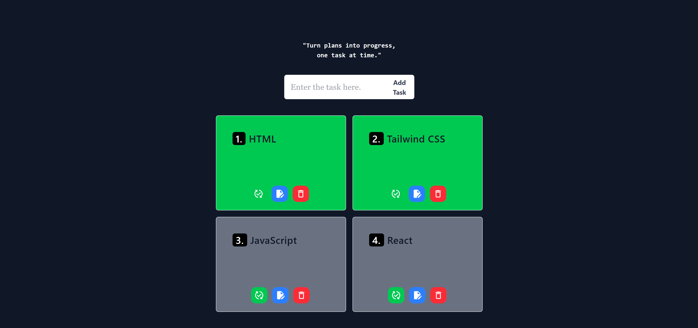
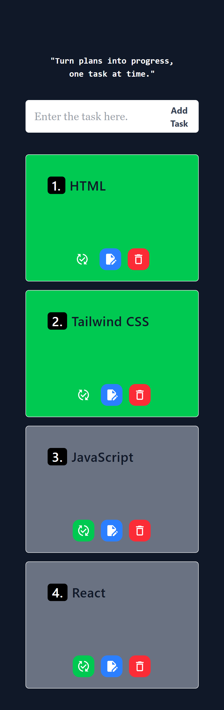

# To-Do App

A simple and responsive To-Do list application built with **React** and **Tailwind CSS**, using **useState**, **useEffect** for lifecycle handling and **localStorage** for data persistence.

## 🚀 Features

- ✅ Add, Delete, Edit and Update tasks
- 📦 Persist tasks in `localStorage`
- 🎯 Mark tasks as completed
- 🌙 Clean and responsive UI with Tailwind CSS
- 🔄 Sync state with localStorage using `useEffect`

## 🛠️ Built With

- [React](https://reactjs.org/)
- [Tailwind CSS](https://tailwindcss.com/)
- [Material UI](https://mui.com/material-ui/material-icons/)(for adding icons)
- JavaScript (ES6+)
- LocalStorage API
- React Hooks (`useState`, `useEffect`)

## Screenshots

- In Large Screen
  
- In Small Screen
  

## Demo Link

[Live Demo](https://r-react-todoapp.netlify.app/)
